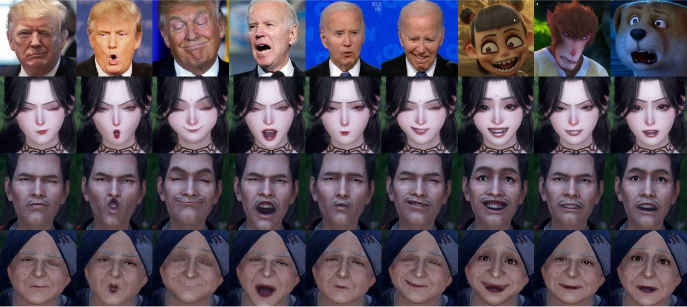
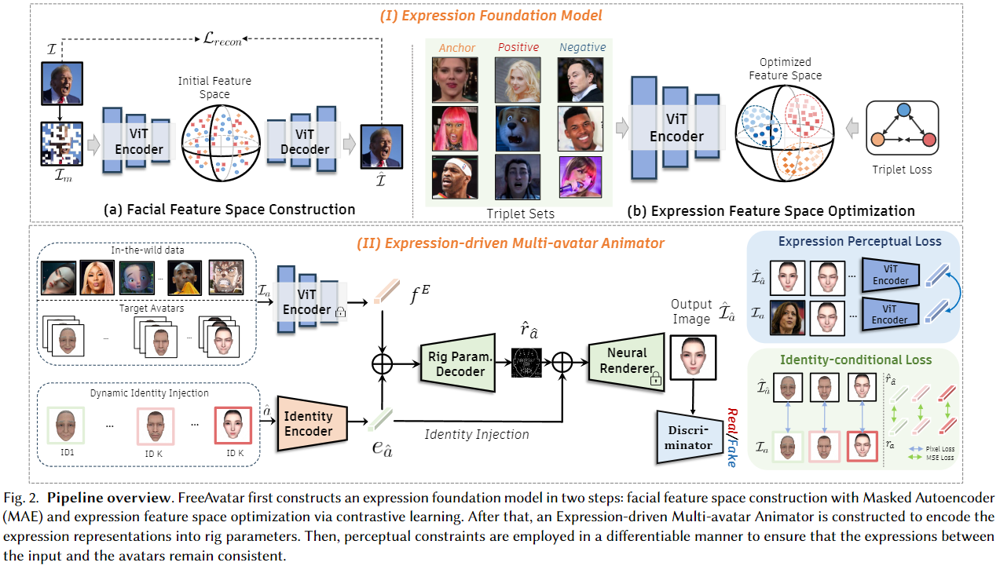

# FreeAvatar：Robust 3D Facial Animation Transfer by Learning an Expression Foundation Model



## Abstract
> Video-driven 3D facial animation transfer aims to drive avatars to reproduce the expressions of actors. Existing methods have achieved remarkable results by constraining both geometric and perceptual consistency. However, geometric constraints (like those designed on facial landmarks) are insufficient to capture subtle emotions, while expression features trained on classification tasks lack fine granularity for complex emotions. To address this, we propose FreeAvatar, a robust facial animation transfer method that relies solely on our learned expression representation. Specifically, FreeAvatar consists of two main components: the expression foundation model and the facial animation transfer model. In the first component, we initially construct a facial feature space through a face reconstruction task and then optimize the expression feature space by exploring the similarities among different expressions. Benefiting from training on the amounts of unlabeled facial images and re-collected expression comparison dataset, our model adapts freely and effectively to any in-the-wild input facial images. In the facial animation transfer component, we propose a novel Expression-driven Multi-avatar Animator, which first maps expressive semantics to the facial control parameters of 3D avatars and then imposes perceptual constraints between the input and output images to maintain expression consistency. To make the entire process differentiable, we employ a trained neural renderer to translate rig parameters into corresponding images. Furthermore, unlike previous methods that require separate decoders for each avatar, we propose a dynamic identity injection module that allows for the joint training of multiple avatars within a single network. The comparisons show that our method achieves prominent performance even without introducing any geometric constraints, highlighting the robustness of our FreeAvatar.


## Requirements
- imageio==2.28.1
- matplotlib==3.7.5
- numpy==1.23.5
- opencv_contrib_python==4.8.0.76
- opencv_python==4.9.0.80
- opencv_python_headless==4.8.1.78
- Pillow==10.4.0
- PyYAML==6.0.1
- setuptools==45.2.0
- skimage==0.0
- timm==0.9.2
- torch==2.1.0
- torchvision==0.16.0
- tqdm==4.65.0
  
This implementation is only tested under the device:

- System: Unbuntu 18.04
- GPU: A30
- Cuda Version: 12.0
- Cuda Driver Version: 525.78.01

We also used the MAE PyTorch/GPU implementation for pre-training our facial expression foundation model. For more dependencies, please refer to https://github.com/facebookresearch/mae.


## Method

Our FreeAvatar includes three components:
- Facial Feature Space Construction 
- Expression Feature Space Optimization
- Expression-driven Multi-avatar Animator

### Facial Feature Space Construction

We used the ViT-B model of MAE for pre-training the facial reconstruction task. We used the ViT-B model for pre-training the facial reconstruction task. For more training details, please refer to https://github.com/facebookresearch/mae.


### Expression Feature Space Optimization

- Finetuing the ViT encoder on expression comparison triplets.
  ```
  python train.py
  ```


### Expression-driven Multi-avatar Animator

- Training Neural Renderer.
  ```
  python train_rig2img.py
  ```


- Training Rig Parameter Decoder. 
  ```
  python train_emb2rig_multichar.py
  ```
    The data path and training parameters can be modified in the configuration file `configs_emb2rig_multi.yaml`. To perform testing, specify pretrained and set `mode='test'`.

## Citation
If you use this project for your research, please consider citing:

## Contact
If you have any questions, please contact
- Feng Qiu (qiufeng@corp.netease.com)
- Wei Zhang (zhangwei05@corp.netase.com)
- Lincheng Li (lilincheng@corp.netease.com)

## Acknowledgement

There are some functions or scripts in this implementation that are based on external sources. We thank the authors for their excellent works. Here are some great resources we benefit:

- [MAE_pytorch](https://github.com/facebookresearch/mae) for the expression foundation training code.
- [Nvdiffrast](https://github.com/NVlabs/nvdiffrast) for differentiable rendering.
- [Fuxi Youling Platform](https://fuxi.163.com/) for data collection and annotation.